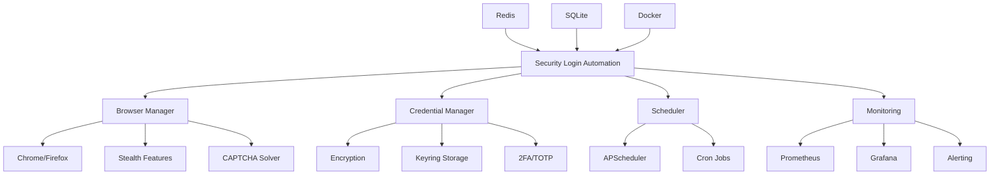

# 🔐 Security Login Automation System

A cutting-edge Selenium-based automation system for daily security login requirements with advanced stealth capabilities, monitoring, and enterprise-grade features.

## 🚀 Features

### Core Automation
- **Advanced Selenium WebDriver** with undetected Chrome and stealth mode
- **Multi-browser support** (Chrome, Firefox, Playwright)
- **Human-like behavior simulation** with random delays and mouse movements
- **Anti-detection techniques** to bypass bot detection systems
- **Automatic CAPTCHA solving** using OCR and computer vision
- **2FA/TOTP support** with automatic code generation

### Security & Authentication
- **Encrypted credential storage** using Fernet encryption
- **Keyring integration** for secure password management
- **2FA/TOTP code generation** with QR code support
- **Session management** with Redis caching
- **Backup code support** for emergency access

### Monitoring & Observability
- **Prometheus metrics** for performance monitoring
- **Grafana dashboards** for visualization
- **Structured logging** with Loguru
- **Health checks** and alerting
- **Screenshot capture** for debugging and verification
- **Session tracking** with SQLite database

### Deployment & Operations
- **Docker containerization** with docker-compose
- **Kubernetes ready** configuration
- **Automated scheduling** with APScheduler
- **Cloud deployment** support (AWS, GCP, Azure)
- **Horizontal scaling** capabilities
- **VNC support** for remote debugging

## 🛠 Quick Start

### 1. Deploy the System

```bash
# Clone and deploy
chmod +x deploy.sh
./deploy.sh deploy
```

### 2. Add Your First Site

```bash
# Interactive site configuration
python3 config_manager.py add
```

### 3. Test the Login

```bash
# Test your configuration
python3 config_manager.py test --site your_site_name
```

### 4. Monitor the System

- **Grafana Dashboard**: http://localhost:3000 (admin/admin123)
- **Prometheus Metrics**: http://localhost:9090
- **Application Metrics**: http://localhost:8080/metrics

## 📦 Installation Options

### Option 1: Docker Deployment (Recommended)

```bash
# Full deployment with monitoring
./deploy.sh deploy

# View logs
docker-compose logs -f

# Stop services
docker-compose down
```

### Option 2: Local Development Setup

```bash
# Install dependencies
pip install -r requirements.txt

# Install system dependencies (Ubuntu/Debian)
sudo apt-get update
sudo apt-get install -y \
    chromium-browser \
    firefox \
    tesseract-ocr \
    tesseract-ocr-eng

# Run locally
python3 security_login_automation.py
```

### Option 3: Cloud Deployment

```bash
# AWS ECS deployment
./deploy.sh deploy --cloud aws

# Kubernetes deployment
kubectl apply -f k8s/
```

## 🔧 Configuration

### Environment Variables

Create a `.env` file:

```env
# Redis Configuration
REDIS_HOST=redis
REDIS_PORT=6379

# Browser Settings
DEFAULT_BROWSER=chrome
HEADLESS_MODE=false
STEALTH_MODE=true

# Security
MAX_LOGIN_ATTEMPTS=3
SESSION_TIMEOUT=3600
ENABLE_2FA=true

# Monitoring
ENABLE_METRICS=true
ENABLE_SCREENSHOTS=true
LOG_LEVEL=INFO

# Scheduling
DEFAULT_SCHEDULE=0 9 * * *  # Daily at 9 AM
```

### Site Configuration

```yaml
# configs/automation_config.yml
browser:
  type: chrome
  headless: false
  stealth: true
  timeout: 30

security:
  max_attempts: 3
  retry_delay: 60
  session_timeout: 3600
  enable_2fa: true

sites:
  - name: example_site
    url: https://example.com/login
    enabled: true
    schedule: "0 9 * * *"  # Daily at 9 AM
```

## 🎯 Usage Examples

### Adding Sites

```bash
# Interactive mode
python3 config_manager.py add

# List configured sites
python3 config_manager.py list

# Enable/disable sites
python3 config_manager.py enable-disable

# Update schedules
python3 config_manager.py schedule
```

### Testing Logins

```bash
# Test specific site
python3 config_manager.py test --site gmail

# Test all sites
python3 config_manager.py test
```

### Managing 2FA

```bash
# Generate QR code for 2FA setup
python3 config_manager.py qr

# Test TOTP generation
python3 -c "
from security_login_automation import SecurityLoginAutomation
automation = SecurityLoginAutomation()
code = automation.generate_totp('YOUR_SECRET_KEY')
print(f'Current TOTP: {code}')
"
```

## 🏗 Architecture



## 🔍 Advanced Features

### Stealth Mode

The system includes advanced anti-detection features:

- **Undetected Chrome** driver
- **Random user agents** and browser fingerprints
- **Human-like timing** and mouse movements
- **WebRTC leak protection**
- **Canvas fingerprint randomization**

### Computer Vision

Automatic CAPTCHA solving using:

- **OpenCV** for image processing
- **Tesseract OCR** for text recognition
- **PIL** for image manipulation
- **Adaptive thresholding** and noise reduction

### Enterprise Features

- **High availability** with Docker Swarm/Kubernetes
- **Load balancing** across multiple browser instances
- **Centralized configuration** management
- **Audit logging** and compliance reporting
- **Role-based access control** (RBAC)

## 📊 Monitoring

### Prometheus Metrics

- `security_login_attempts_total` - Total login attempts by site and status
- `security_login_duration_seconds` - Login duration histogram
- `security_active_sessions` - Current active sessions gauge

### Grafana Dashboards

Pre-configured dashboards for:

- **Login Success Rate** over time
- **Response Time Trends** by site
- **Error Rate Analysis**
- **Session Duration Statistics**
- **System Health Monitoring**

### Alerting Rules

- **High failure rate** detection
- **Service downtime** alerts
- **Long response time** warnings
- **CAPTCHA detection** notifications

## 🛡 Security Best Practices

### Credential Protection

- **Encrypted storage** using Fernet encryption
- **Keyring integration** for OS-level security
- **No plaintext passwords** in configuration files
- **Secure key generation** and rotation

### Network Security

- **TLS encryption** for all communications
- **Proxy support** for anonymity
- **VPN integration** capabilities
- **Rate limiting** to avoid detection

### Access Control

- **File permission** restrictions (600 for sensitive files)
- **User isolation** in containers
- **Audit trail** for all operations
- **Secure defaults** throughout

## 🐛 Troubleshooting

### Common Issues

1. **Browser won't start**
   ```bash
   # Check Docker permissions
   docker run --rm -it selenium-automation /bin/bash
   
   # Check X11 forwarding
   export DISPLAY=:99
   Xvfb :99 -screen 0 1920x1080x24 &
   ```

2. **Login fails**
   ```bash
   # Enable debug mode
   python3 config_manager.py test --site your_site --debug
   
   # Check screenshots
   ls -la screenshots/
   ```

3. **2FA issues**
   ```bash
   # Verify TOTP secret
   python3 -c "
   import pyotp
   print(pyotp.TOTP('YOUR_SECRET').now())
   "
   ```

### Log Analysis

```bash
# View live logs
docker-compose logs -f selenium-automation

# Search for errors
grep -i error logs/automation_*.log

# Check structured logs
jq '.level | select(. == "ERROR")' logs/automation_structured_*.json
```

## 🤝 Contributing

1. Fork the repository
2. Create a feature branch
3. Make your changes
4. Add tests
5. Submit a pull request

### Development Setup

```bash
# Install development dependencies
pip install -r requirements.txt
pip install pytest black flake8

# Run tests
pytest tests/

# Format code
black security_login_automation.py

# Lint code
flake8 security_login_automation.py
```

## 📜 License

This project is licensed under the MIT License - see the [LICENSE](LICENSE) file for details.

## ⚠️ Disclaimer

This tool is for legitimate security purposes only. Users are responsible for complying with all applicable laws and terms of service. The authors are not responsible for any misuse of this software.

## 🆘 Support

- **Documentation**: Check this README and inline code comments
- **Issues**: Open a GitHub issue with detailed information
- **Discussions**: Use GitHub Discussions for questions
- **Security**: Report security issues privately via email

---

**Made with ❤️ for security professionals who need reliable automation tools.**
